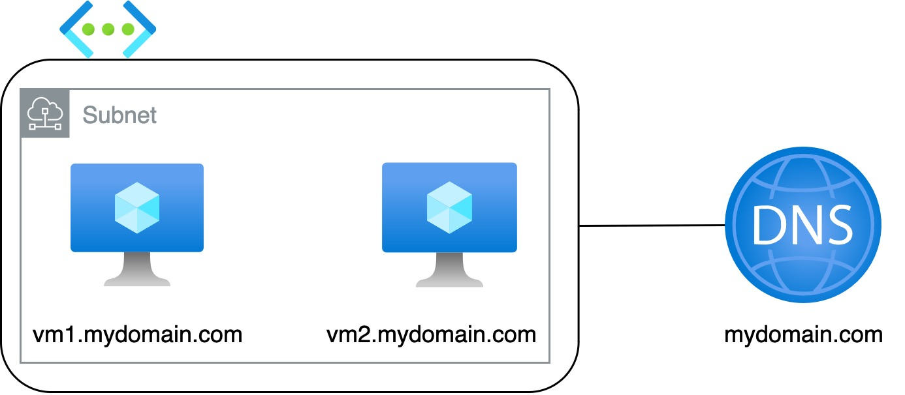

This terraform generates a small network containing two VMs and a Private DNS that resolves given VMs.

Infrastructure:


After deploying them just login on serial console in the first VM and run:
```
ping vm2.mydomain.com
```