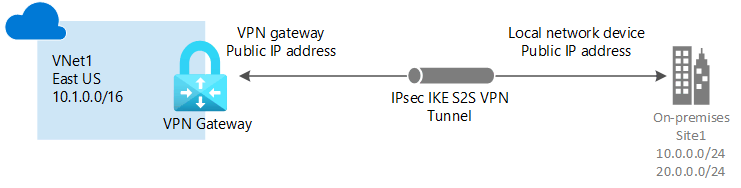

This terraform generates a Virtual Network Gateway with Site-to-Site connection (S2S) that enables a configured VPN device to connect privately to Azure network.

Here the resulting infrastructure. That comes from [here](https://learn.microsoft.com/en-us/azure/vpn-gateway/tutorial-site-to-site-portal).

It also generates a Point-to-Site connection to allow single client to connect. For simplicity I also added used certificates inside the repo.